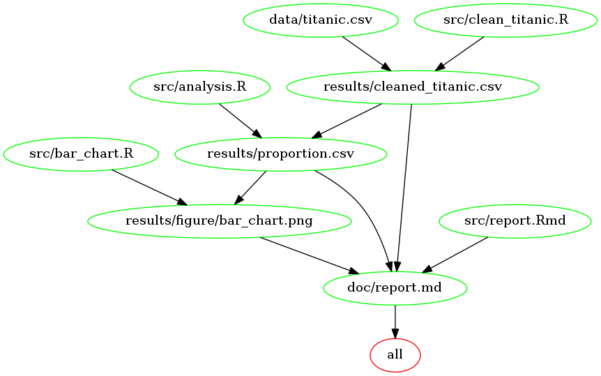

# Analysis on Survivorship of Titanic Passengers

DSCI 522 Project

Xin (Alex) Guo, Nov 2017

## Overview

On April 15, 1912, the British passenger liner "Titanic" sank in the North Atlantic Ocean after it collided with an iceberg during its maiden voyage from Southampton to New York City. There were an estimated 2,224 passengers and crew aboard the ship, and more than 1,500 died, making it one of the deadliest commercial peacetime maritime disasters in modern history. (source: [Wikipedia](https://en.wikipedia.org/wiki/RMS_Titanic)) This project is trying to analyze if passenger class played a role in survivorship. From the result we can get an idea about the effect of passengers' social status and privilege on their fate in this tragedy.

## Dataset

The dataset used in this analysis, [`titanic.csv`](https://github.com/alexguoxin/Survivorship-of-Titanic-Passengers/blob/master/data/titanic.csv), is from [the list of datasets in MDS program](https://github.ubc.ca/ubc-mds-2017/datasets). It describes the survival status of 1,309 individual passengers on Titanic. There are 14 variables in the dataset. Variables were used in this project are `pclass` and `survived`. `pclass` refers to the passenger class (1st, 2nd, 3rd), and is a proxy for socio-economic class. `survived` indicates the survivorship of the passenger with 1 being survived and 0 being perished. 

## Hypothesis

My hypothesis is that more passengers in higher classes survived than those in lower classes because preference was given to passengers in higher classes, or they took advantage of their privilege to get rescued.

## Plan of Action
- Calculate the proportion of survivorship in each passenger class, and show the result in a table
- Create a bar chart to show the proportion difference of survivorship in each passenger class side by side
- Perform a Permutation test and report the p-value to see if the null hypothesis should be rejected or not

## Project Dependencies

- R, version 3.4.1
- R packages:
	- `tidyverse`
	- `coin`
	- `knitr`
	- `ezknitr`

## Usage

### Use Make

If you are sure you have all the required dependencies installed, you may use the Makefile to run the full analysis. Open the command line/terminal/Git bash and follow the steps below:

1. Use command `cd` to change the current directory to where you want to store the project by typing

```
cd PATH_TO_WHERE_YOU_WANT_TO_STORE_THE_PROJECT
```

2. Clone the project repository to the current directory by typing

```
git clone https://github.com/alexguoxin/Survivorship-of-Titanic-Passengers.git
```

3. Use command `cd` to navigate to the project root directory

```
cd Survivorship-of-Titanic-Passengers/
```

4. Use the Makefile to run the full analysis by typing

```
make all
```

5. If you want to re-run the analysis, delete all files generated in the previous run before you re-run it by typing

```
make clean
```

### Use `packrat` or Docker

If you are not sure you have all the required dependencies installed, or you fail to run the Makefile, you could use `packrat` or the Docker image to run the full analysis. 

#### Use `packrat`

1. If you do not have R installed yet, follow the instruction [here](https://cran.r-project.org/) to install it.

2. Open the command line/terminal/Git bash. If you do not have package `packrat` installed yet, install it by typing

```
Rscript -e "install.packages('ezknitr', repos = 'http://cran.us.r-project.org')"
```

3. Use `packrat` to install all required R packages by typing

```
Rscript -e "packrat::restore()"
```

4. Follow the steps 1-5 in "Use Make" to use the Makefile to run the full analysis.

#### Use Docker

1. If you do not have Docker installed yet, follow the instruction [here](https://docs.docker.com/engine/installation/) to install it.

2. Open the command line/terminal/Git bash. Use command `cd` to change the current directory to where you want to store the project by typing

```
cd PATH_TO_WHERE_YOU_WANT_TO_STORE_THE_PROJECT
```

3. Clone the project repository to the current directory by typing

```
git clone https://github.com/alexguoxin/Survivorship-of-Titanic-Passengers.git
```

4. Pull the Docker image by typing

```
docker pull alexguoxin/survivorship-of-titanic-passengers
```

5. Launch a Docker container and run the full analysis in the container by typing

```
docker run --rm -v VOLUME_ON_YOUR_COMPUTER:VOLUME_ON_CONTAINER alexguoxin/survivorship-of-titanic-passengers make -C 'VOLUME_ON_CONTAINER' all
```

`VOLUME_ON_YOUR_COMPUTER` is the absolute local path to the project root directory where you just cloned.

`VOLUME_ON_CONTAINER` is a path in the docker container where you want to link your local path to, e.g. `/home/Survivorship-of-Titanic-Passengers`.

6. If you want to re-run the analysis, delete all files generated in the previous run before you re-run it by typing

```
docker run --rm -v VOLUME_ON_YOUR_COMPUTER:VOLUME_ON_CONTAINER alexguoxin/survivorship-of-titanic-passengers make -C 'VOLUME_ON_CONTAINER' clean
```

## Dependency Diagram

A dependency diagram of the Makefile using [`makefile2graph`](https://github.com/lindenb/makefile2graph) is shown below.

