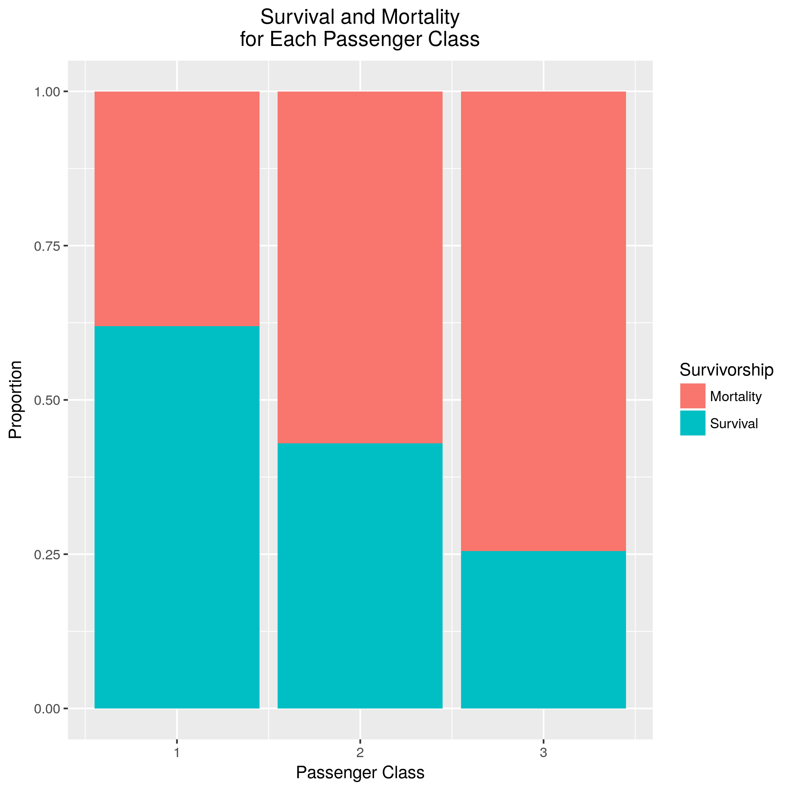

# Analysis on Survivorship of Titanic Passengers

Xin (Alex) Guo, Dec 2017

## Overview

On April 15, 1912, the British passenger liner "Titanic" sank in the North Atlantic Ocean after it collided with an iceberg during its maiden voyage from Southampton to New York City. There were an estimated 2,224 passengers and crew aboard the ship, and more than 1,500 died, making it one of the deadliest commercial peacetime maritime disasters in modern history. (source: [Wikipedia](https://en.wikipedia.org/wiki/RMS_Titanic)) This project is trying to analyze if passenger class played a role in survivorship. From the result we can get an idea about the effect of passengers' social status and privilege on their fate in this tragedy.

## Dataset

The dataset used in this analysis, [`titanic`](https://github.ubc.ca/ubc-mds-2017/datasets/blob/master/data/titanic.csv), is from the list of datasets in MDS program. It describes the survival status of 1,309 individual passengers on Titanic. The variables in the dataset are `pclass`, `survived`, `name`, `sex`, `age`, `sibsp`, `parch`, `ticket`, `fare`, `cabin`, `embarked`, `boat`, `body` and `home.dest`. `pclass` refers to the passenger class (1st, 2nd, 3rd), and is a proxy for socio-economic class. `survived` indicates the survivorship of the passenger with 1 being survived and 0 being perished. 

## Hypothesis

My hypothesis is that more passengers in higher classes survived than those in lower classes because preference was given to passengers in higher classes, or they took advantage of their privilege to get rescued.

## Analysis

First, the proportion of survival and mortality for each passenger class was calculated and shown in the table below.


| pclass|  Survival| Mortality|
|------:|---------:|---------:|
|      1| 0.6191950| 0.3808050|
|      2| 0.4296029| 0.5703971|
|      3| 0.2552891| 0.7447109|

Second, a bar chart showing the proportion of survival and mortality for each passenger class was created.



From the table and the bar chart, it is obvious that more passengers in higher classes survived than those in lower classes.

To see if there is a statistically significant difference in the survival/mortality between each passenger class, a Permutation test was performed and the result is shown below.


```
## 
## 	Asymptotic General Independence Test
## 
## data:  titanic$survived by titanic$pclass (1, 2, 3)
## maxT = 10.251, p-value < 2.2e-16
## alternative hypothesis: two.sided
```

From the result above, the p-value (< 2.2e-16) is much less than the 5% significance level, so we can reject the null hypothesis that passenger class did not play a role in survivorship, i.e. passengers in higher classes did have more chance to survive than those in lower classes. Is it because preference was given to passengers in higher classes, or they took advantage of their privilege to get rescued？This project could not have a clear conclusion on the reason and it will be an interesting topic for future analysis.
